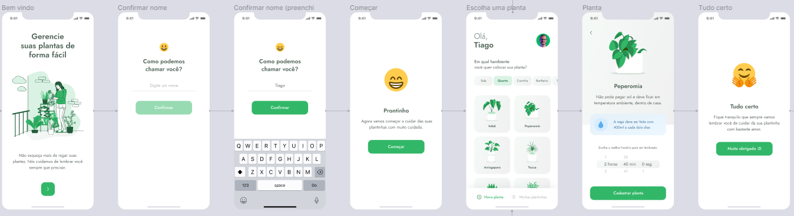

<div align="center">
  
  <h1>PlantManager</h1>
  <p>🌱 Application to remind people to water their plants 🌱</p>
  <p>
    
    <a href="https://linktr.ee/Vivi3008" target="_blank" rel="noopener noreferrer">
      
    </a>          
    
  </p>
</div>

# Sobre

Plant Manager é um aplicativo que ajuda você a controlar e acompanhar o cuidado com suas plantas.

<div align="center">
   
</div>

<br>
<br>

# 🚀 Tecnologias

- [Node.js](https://nodejs.org/en/)
- [Expo](https://expo.io/)
- [React Native](https://reactnative.dev/)
- [TypeScript](https://www.typescriptlang.org/)
- [ESlint](https://eslint.org/)
- [Prettier](https://prettier.io/)
- [EditorConfig](https://editorconfig.org/)

## 💻 Iniciando o projeto

### Pré-requisitos

- [Node.js](https://nodejs.org/en/)
- [Expo](https://expo.io/)
- [Yarn](https://classic.yarnpkg.com/) or [NPM](https://www.npmjs.com/)

### Instalando e rodando o projeto

_Clone o projeto e acesse a pasta_

```bash
$ git clone https://github.com/hmartiins/plantmanager
$ cd plantmanager
```

_Siga os passos abaixo_

```bash
# Install the dependencies
$ yarn install

# Finally, run the api service in a development environment :)
$ yarn start

# Well done, PlantManager is started!
```

<br>

<hr>
<div align="center">
  <sub>Copyright © 2021-present, ViviRamos.</sub>
</div>
<hr>
